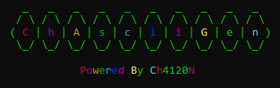
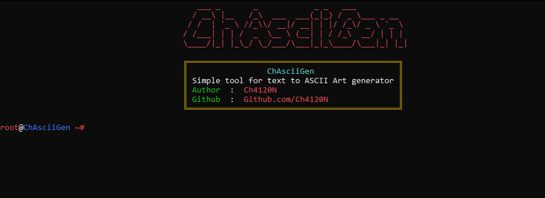
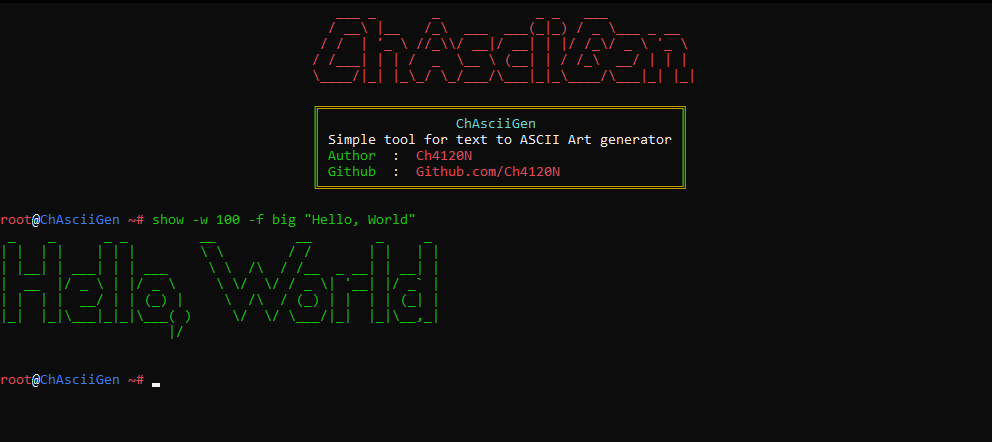

<div align="center">



# ChAsciiGen
### _Text to ASCII Art Generator — Beautifully Simple, Fully Offline_


---

> **ChAsciiGen** is a powerful cross-platform Python tool that converts your text into stunning ASCII art — completely offline, without any internet connection.

</div>

---

## 👨‍💻 Project Programmer
> **Ch4120N** — [Ch4120N@Proton.me](mailto:Ch4120N@Proton.me)

---

## 🧠 Made For
> Developers and terminal enthusiasts who love clean, creative ASCII art.

---

## 🖼️ Screenshots

<div align="center">

| Example 1 | Example 2 |
|:----------:|:----------:|
|  |  |

</div>

---

## ⚓ Requirements
- **Python 3.7+**

### 📦 Installing Dependencies
```bash
python -m pip install -r requirements.txt
```

## ⚙️ Installation Guide
### Linux
```bash
sudo apt install python3 git -y
git clone https://github.com/Ch4120N/ChAsciiGen.git
chmod 755 -R ChAsciiGen
cd ChAsciiGen
python3 -m pip install -r requirements.txt
sudo python3 ChAsciiGen.py
```

### Windows
If you have Git installed:
```cmd
git clone https://github.com/Ch4120N/ChAsciiGen.git
cd ChAsciiGen
python -m pip install -r requirements.txt
python ChAsciiGen.py
```
Otherwise, [download the ZIP release](https://github.com/Ch4120N/ChAsciiGen/releases), extract it, and run it directly.

## 💻 Supported Platforms
- [X] **All Operating Systems** (Linux, Windows, macOS, etc.)

## ✨ Features
- **🧩 400+ ASCII Art Fonts**
- **💡 Cross-Platform Support**
- **💬 Interactive Shell**
- **⚙️ Fully Configurable**
- **🧠 Command-Line Argument Support**
- **📝 Configuration File Support**
- **📦 Backup & Restore Configs**
- **🌈 Colorful, Informative Output**
- **🚀 Advanced Error Handling**
- **🔧 Easy to Extend**

## ❤️ Support the Project
If you find this tool useful, consider donating:

| Cryptocurrency | Address                                      |
| :------------- | :------------------------------------------- |
| **BTC**        | `bc1ql4syps7qpa3djqrxwht3g66tldyh4j7qsyjkq0` |
| **ETH**        | `0xfddbd535a4ad28792cbebceee3d6982d774e6d13` |
| **USDT**       | `3Cq6HRQsiwZFmPEQfG9eJkZE2QGChvf2VN`         |
> 💖 Your support helps keep the project alive and improving!

## 🚨 Reporting Issues
> If you encounter bugs, configuration issues, or unexpected behavior, please reach out: 
📩 Ch4120N@Proton.me

<div align="center">

“Turning plain text into ASCII masterpieces — one line at a time.”

**⭐ If you like this project, don’t forget to give it a star!**

</div> 